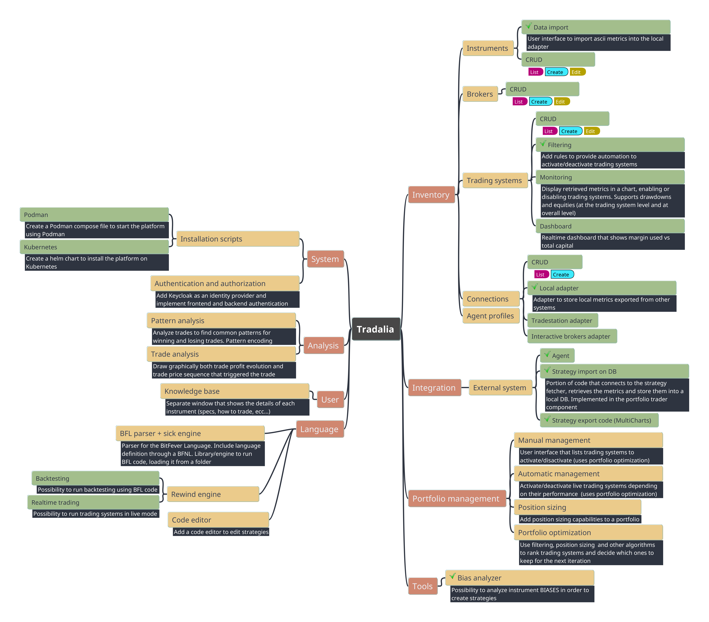

# The Tradalia Platform

## Introduction

**Tradalia** is a platform specifically designed for algorithmic trading. The idea is to design a platform that helps
algo traders to:

- Write trading systems, using a simple IDE and leveraging a programming language specifically designed for trading
- Run them in a sandbox, taking data from a data provider and executing trades in a broker
- Monitor all activities, alerting traders when new issues arises
- Manage the portfolio, automatically selecting which systems should be activated and which ones should be deactivated

What you won't find here:
- All tools needed for a discretionary trader (like technical analysis, sketching on charts)

The platform is aimed at **Futures trading**, which means that traders wanting to trade *options*, *stocks* and *forex* will
need to look at other platforms (at least for now).

In the spirit of open source software, all platform components will be free and under the permissive MIT license. 
We believe in the community and in collaboration, without which a platform like this won't be possible. 

## Goals

Simply stated, the **Tradalia** platform will try to address all pain points of current systems. Specifically:

- No need to manually rollover any contract. The platform will automatically roll contracts a day before expiration
- No need for continuous contracts or custom futures. The platform will automatically build continuous contracts on the fly
- As a consequence of the previous bullet, no need to reload continuous contracts at every rollover
- Money (costs, point value) at broker level. This allows traders to use data from big contracts (like ES, NQ, CL, GC,
  ...) when trading micro instruments (like MES, MNQ, MCL, MGC, ...)
- No need to turn on/off trading systems. This can be done automatically specifying filters
- Robustness: a trading system's position must **never** go out of sync with the associate position in the broker

## Features and roadmap

The list of features and a (possible) roadmap is depicted below. A green checkmark indicates that the feature is ready.

## Architecture

The general architecture is described [here](architecture/architecture.md)

## Core concepts

Core concepts are described [here](concepts/concepts.md)
