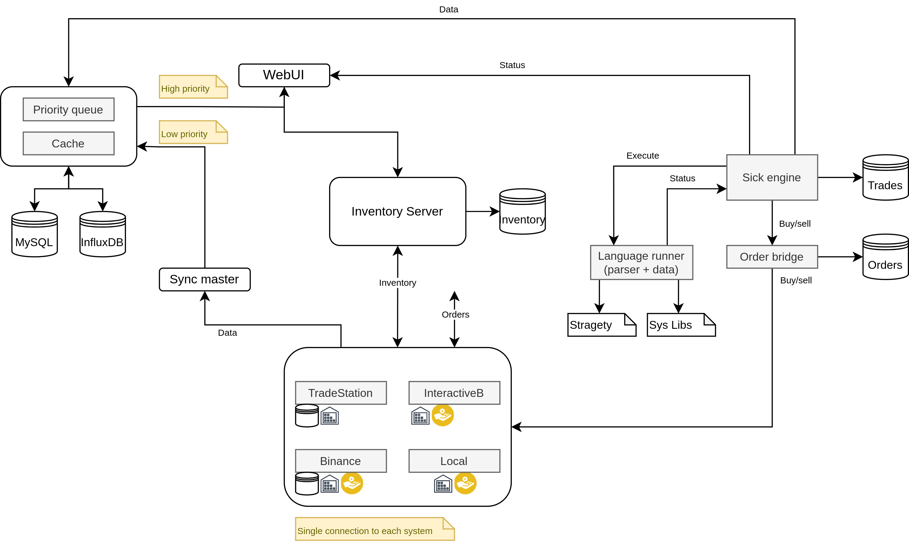

# Architecture

## Introduction

The platform is designed as a set of microservices and engines. Here is a list them:

| Component             | Notes                                                                                          |
|-----------------------|------------------------------------------------------------------------------------------------|
| Gateway               | Common entrypoint for the platform that dispatches requests to all other components            |
| Web user interface    | Graphical interface of the platform                                                            |
| Inventory Server      | Manages the inventory: trading systems, portfolios, sessions, instruments, connections, etc... |
| Portfolio Trader      | Takes care of trading system executions, metrics collection and money management in general    |
| Data Collector        | Store instrument data into a local database (Influx DB). Provide data to all other components  |
| System Adapter        |                                                                                                |
| Shell                 | This is the BitFever Shell (BFS). Command Line Interface to interact with the platform         |
| Keycloak integration  | Component to implement user management and provisioning                                        |

There is also a small set of other minor components. As the development of the platform requires ages, some components
have been developed to take advantage of other existing products (like Multicharts).

| Component               | Notes                                                                               |
|-------------------------|-------------------------------------------------------------------------------------|
| Strategy Fetcher        | Component to read exported metrics generated above and export them as REST services |
| Strategy metrics export | Multicharts function in PowerLanguage to export daily profits in semi-CSV format    |

## Design

## Database

